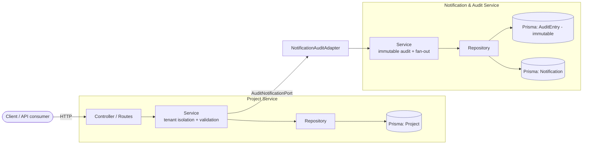
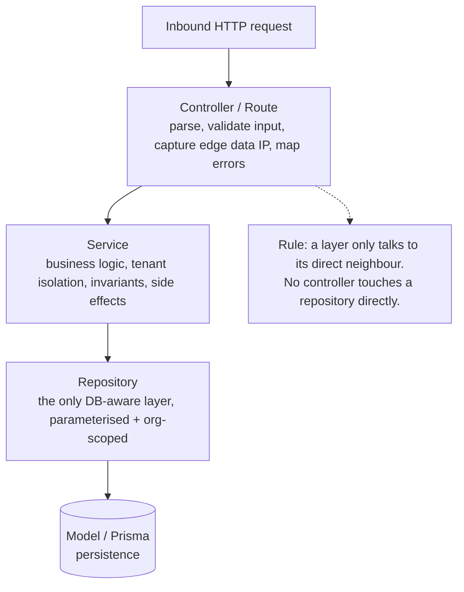
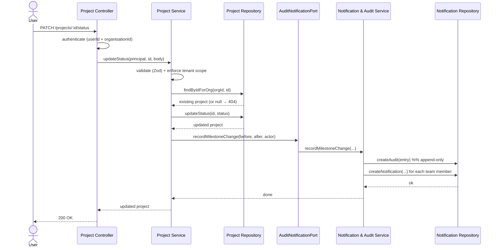
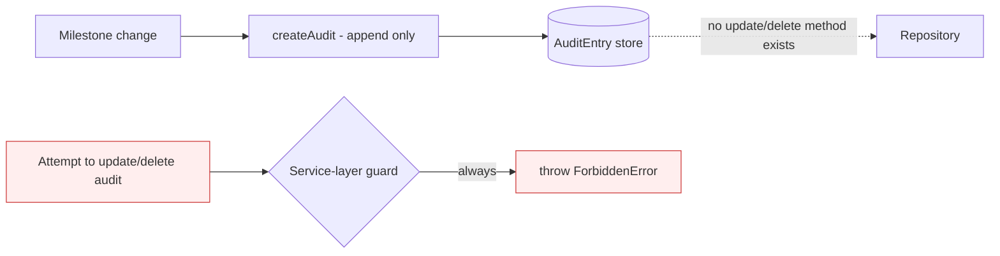
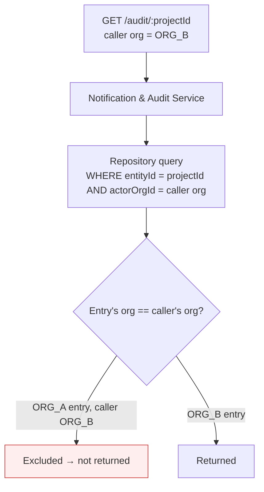
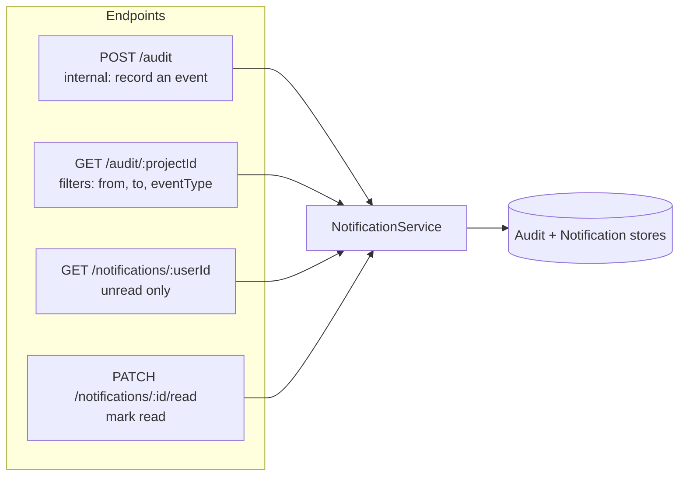

# TaskBridge — Application Flow Diagrams

> A visual walkthrough of how TaskBridge works, from the big picture down to request-level flows.
> Diagrams use [Mermaid](https://mermaid.js.org/), which renders natively on GitHub and in VS Code's
> Markdown preview.

---

## 1. System overview — two services, one contract

**Key idea:** the Project Service never imports the other service directly — it depends only on the
`AuditNotificationPort` interface, which `NotificationAuditAdapter` implements. This keeps the two
services decoupled and independently deployable.

---

## 2. Layered architecture (same in both services)

---

## 3. Milestone change flow (create / update-status / delete / reopen)

This is the core cross-service flow: every milestone change produces an **audit entry** plus
**notifications** to all team members.

---

## 4. Audit immutability (why there is no update/delete)

**Two defences:** (1) the repository exposes **no** update/delete method for audit entries, and
(2) an explicit service-layer guard throws on any modification attempt — so immutability is provable
by a test, not just implied.

---

## 5. Multi-tenant isolation (audit read example)

Every data access is scoped by `organisationId`. A caller from one organisation can never see
another organisation's audit entries — enforced in the service/repository, verified by test #6.

---

## 6. The four Notification & Audit endpoints

---

## Quick legend

| Symbol | Meaning |
|--------|---------|
| Rounded box | Actor / external client |
| Rectangle | Code layer (controller / service / repository / adapter) |
| Cylinder `[( )]` | Persistent store (Prisma model) |
| Red fill | A blocked / rejected path (immutability or tenant denial) |
